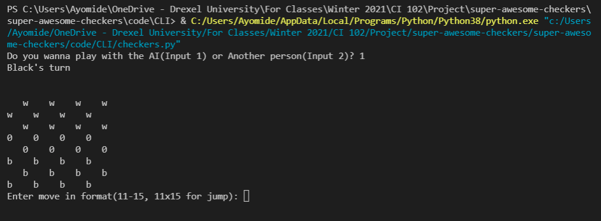

# System Requirements
## Hardware Requirements 
**There are no real Hardware requirements, but RAM of about 8GB or more will help speed up the AI part of the Game**

## Software Requirements 
- python >= 3.8.0

---

# Installation
## Using the packaged .exe
**For Windows** -> [here](https://drive.google.com/file/d/11G7-uI0Wcli5vVVxAtF_gHYlMDvddnYz/view?usp=sharing)
**For Mac** -> [here](https://drive.google.com/drive/folders/1yt1MzdwQMhNQACJpm_XXtBQJfherdxie?usp=sharing)

## Cloning from this repository
- First run `git clone https://gitlab.cci.drexel.edu/fds21/70masterminds/super-awesome-checkers.git`
- Install the python requirements `pip install -r requirements.txt`
- Run the checkers file to start the game `python checkers.py` or `python3 checkers.py`

### If you want to package the game on your own
- For `.EXE` pyinstaller  use [PyInstaller](https://pyinstaller.readthedocs.io/en/stable/usage.html) or [Py2exe](https://pypi.org/project/py2exe/)

---

# Contact Us
| Name | Email |
| ----------- | ----------- |
| Jake Dreher | jjd358@drexel.edu |
| Harshil Thakur | ht377@drexel.edu |
| Dubem Okoye | do123@drexel.edu |
| Ayomide Adetunji | aa4449@drexel.edu |
